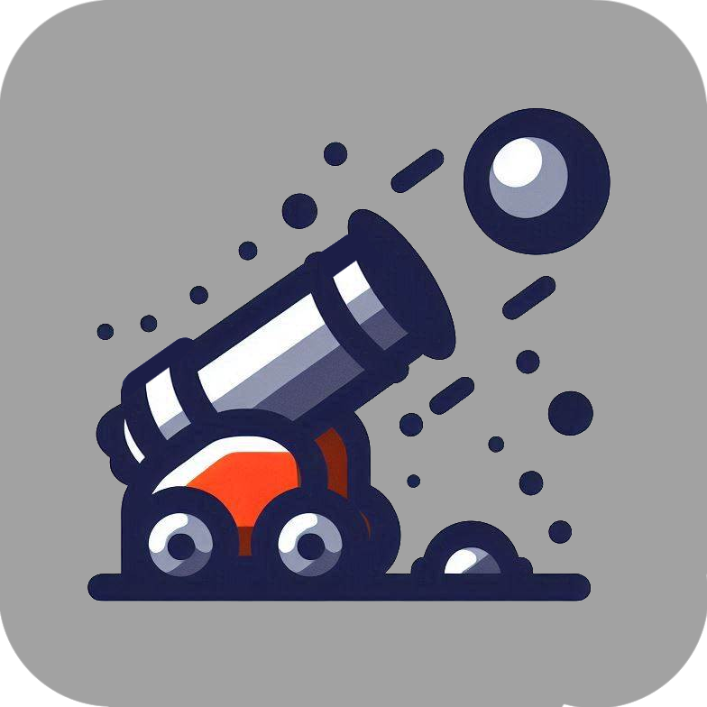

## Oblique Throw: Simulador de Lançamento Oblíquo

Este é um projeto desenvolvido em TypeScript e React que simula o lançamento de uma bolinha em um canhão. O usuário pode interagir com a simulação de diversas maneiras, alterando variáveis e observando os resultados.

  

### Funcionalidades:

- **Controle do Lançamento:**

  - **Ângulo Inicial:** Define o ângulo de lançamento do canhão, o qual pode ser ajustado através de um input numérico.
  - **Velocidade Inicial:** Define a velocidade da bolinha ao sair do canhão, também ajustável através de um input numérico.
  - **Alcance:** Define a distância horizontal que a bolinha deve percorrer. Um alvo se movimenta horizontalmente, indicando a posição em que a bolinha deve cair.
  - **Gravidade:** Permite a seleção de diferentes gravidades (Terra, Lua, Marte e Vácuo), impactando a trajetória da bolinha.

- **Animação e Visualização:**
  - **Trajetória:** A bolinha desenha um traço representando sua trajetória.
  - **Altura Máxima:** Um círculo marca o ponto de altura máxima da trajetória. O valor da altura máxima é exibido ao passar o mouse sobre o círculo.
  - **Rotação do Canhão:** O canhão rotaciona de acordo com o ângulo definido no input.
  - **Animação de Lançamento:** A bolinha sai do canhão com animação e sons.

### Como Usar:

1. Clone este repositório.
2. Instale as dependências: `npm install`, `pnpm install` ou `yarn install`.
3. Execute o projeto: `npm run dev`, `pnpm run dev` ou `yarn run dev`.

### Tecnologias:

- **React:** Framework de desenvolvimento web.
- **TypeScript:** Linguagem de programação que oferece tipagem estática ao JavaScript.
- **Tailwind CSS:** Framework CSS de utilidade para estilos rápidos.

### Recursos:

- **Personalização:** Você pode modificar os valores de entrada para experimentar diferentes cenários e observar como as variáveis influenciam no lançamento.
- **Visualização:** A animação e a visualização detalhada da trajetória facilitam a compreensão do conceito de lançamento oblíquo.
- **Aprendizado:** Este aplicativo pode ser utilizado como ferramenta educacional para estudantes e professores de física.

### Contribuições:

Contribuições são bem-vindas! Sinta-se à vontade para abrir um issue ou um pull request.
